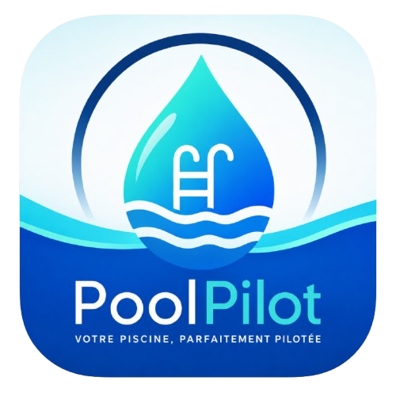
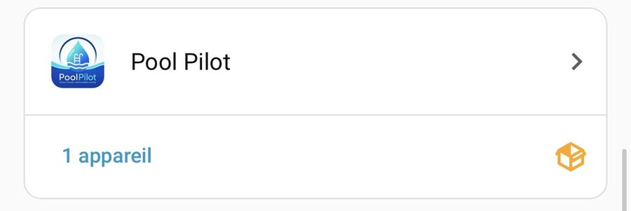
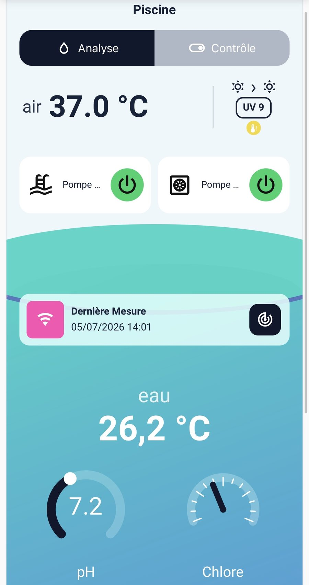
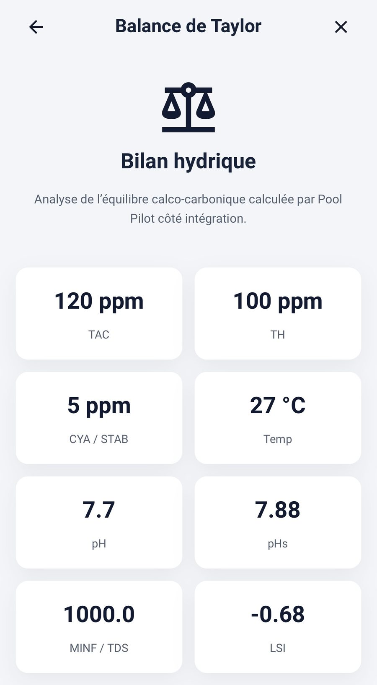
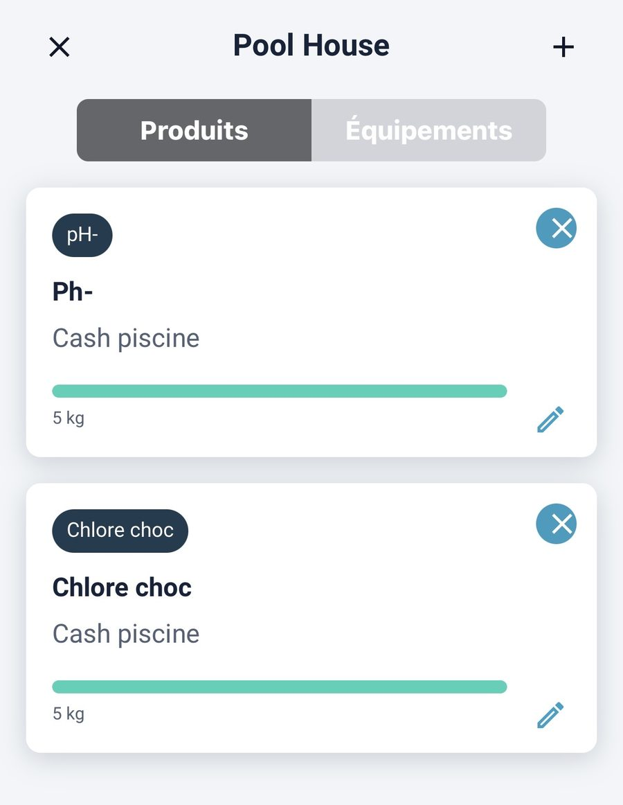
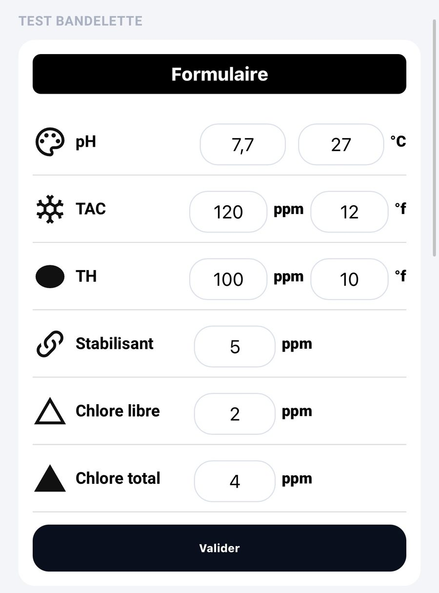
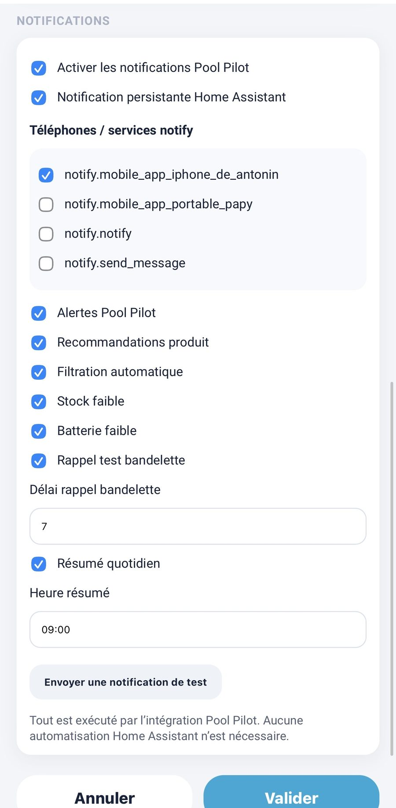
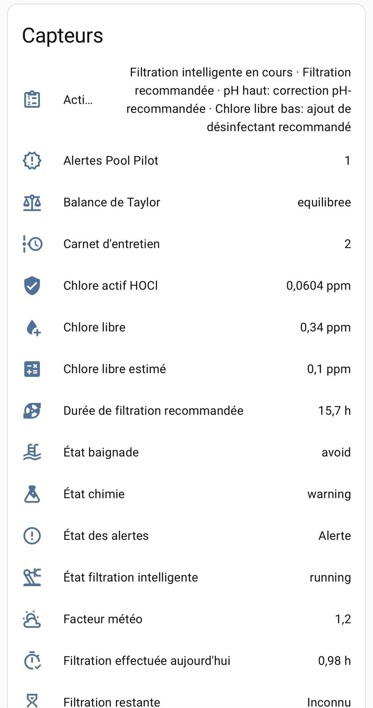
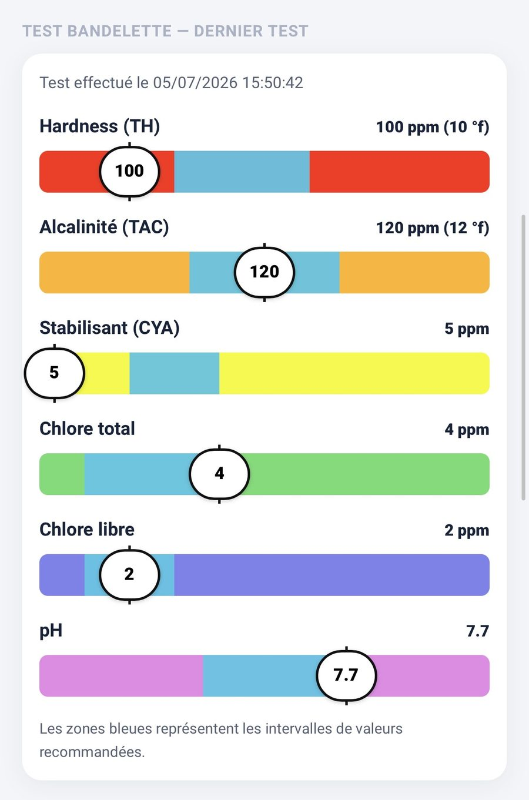

<p align="center">
  
</p>

# Pool Pilot

**Pool Pilot** est une intégration Home Assistant pensée pour piloter, suivre et documenter l’entretien d’une piscine au quotidien.

Elle centralise les mesures de l’eau, calcule la filtration recommandée, suit les alertes, mémorise les tests bandelette, gère les produits du Pool House et expose des entités prêtes à être utilisées dans Lovelace.

<p align="center">
  
</p>

## Points forts

- Filtration intelligente avec durée recommandée quotidienne.
- Mode auto intelligent avec suivi du cycle, heures réalisées et prochaine programmation.
- Analyse des paramètres d’eau : température, pH, chlore, ORP, TAC, TH, stabilisant, sel.
- Estimation du chlore libre à partir de l’ORP, du pH et de la température si aucun capteur chlore n’est disponible.
- Balance de Taylor, LSI, pHs, minF et interprétation de l’équilibre de l’eau.
- Carnet d’entretien et historique des mesures.
- Test bandelette avec sauvegarde persistante.
- Pool House : stock produits, seuils, recommandations et suivi des corrections.
- Notifications Pool Pilot : alertes, stock faible, batterie faible, rappel bandelette, résumé quotidien.
- Démarrage sécurisé : l’intégration ne bloque pas Home Assistant si la météo ou une entité externe est indisponible.

## Captures

| Suivi piscine | Balance de Taylor | Pool House |
|---|---|---|
|  |  |  |

| Test bandelette | Notifications | Entités exposées |
|---|---|---|
|  |  |  |

## Installation via HACS

1. Ouvrir **HACS**.
2. Aller dans **Dépôts personnalisés**.
3. Ajouter le dépôt :

```text
https://github.com/amery74/ha-poolpilot
```

4. Choisir le type **Intégration**.
5. Installer **Pool Pilot**.
6. Redémarrer Home Assistant.
7. Aller dans **Paramètres → Appareils et services → Ajouter une intégration**.
8. Rechercher **Pool Pilot**.

## Configuration

Lors de l’ajout de l’intégration, Pool Pilot demande les principales informations de la piscine :

- nom de la piscine ;
- type de traitement ;
- volume en m³ ;
- type de revêtement ;
- capteur température ;
- pH, ORP, chlore libre ou chlore estimé ;
- pompe de filtration ;
- météo ou capteur de température prévue ;
- pompe à chaleur ou couverture si disponible.

Les options avancées permettent d’ajuster :

- pH cible ;
- chlore libre cible ;
- durée minimale et maximale de filtration ;
- coefficient de filtration ;
- heure centrale de filtration ;
- seuils de température ;
- sensibilité au risque d’algues ;
- notifications.

## Entités principales

Pool Pilot expose notamment : état de santé de l’eau, alertes, balance de Taylor, carnet d’entretien, chlore actif / HOCl, chlore libre estimé, durée de filtration recommandée, état de baignade, état filtration intelligente, facteur météo, filtration effectuée aujourd’hui, Pool House et test bandelette.

## Filtration intelligente

Le mode auto intelligent calcule chaque jour une durée de filtration à partir de la température de l’eau, de la météo prévue, des seuils configurés, des limites minimum/maximum et de la plage horaire autorisée.

Le cycle expose dans ses attributs : état, durée cible, durée déjà effectuée, limite de fin, prochaine programmation, fenêtres prévues et détail du calcul.

## Tests bandelette

Les tests bandelette sont mémorisés dans l’intégration et restaurés après redémarrage.

<p align="center">
  
</p>

Les valeurs peuvent alimenter les calculs d’équilibre de l’eau et compléter les capteurs physiques.

## Notifications

Pool Pilot peut envoyer des alertes eau, recommandations produits, suivis de filtration automatique, alertes stock faible, alertes batterie faible, rappels test bandelette et résumés quotidiens.

Les préférences sont sauvegardées côté intégration et restent conservées après redémarrage.

## Carte Lovelace recommandée

Pour une interface complète, installez aussi la carte :

```text
https://github.com/amery74/pool-pilot-dashboard
```

Type HACS : **Tableau de bord / Plugin**.

## Dépannage

Après une mise à jour : redémarrer Home Assistant, vider le cache de l’application si l’ancienne carte reste affichée, puis vérifier les logs avec :

```bash
ha core logs -n 100
```

Les warnings Home Assistant indiquant qu’une intégration personnalisée n’est pas testée sont normaux pour une intégration installée via HACS.

## Versions recommandées

- Pool Pilot : **v1.0.1** ou plus récent.
- Pool Pilot Dashboard : **v1.0.1** ou plus récent.
- Home Assistant : version récente avec HACS.

## Licence

Projet personnel Home Assistant pour le suivi et l’automatisation d’une piscine résidentielle.
