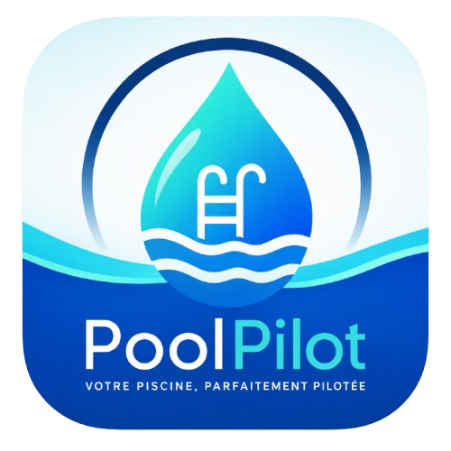
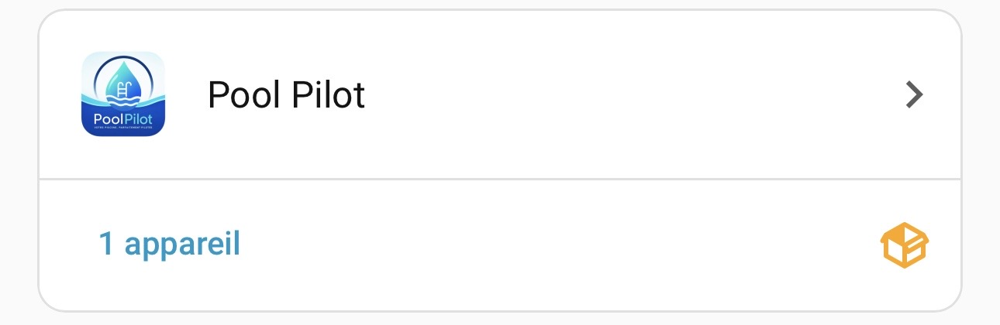
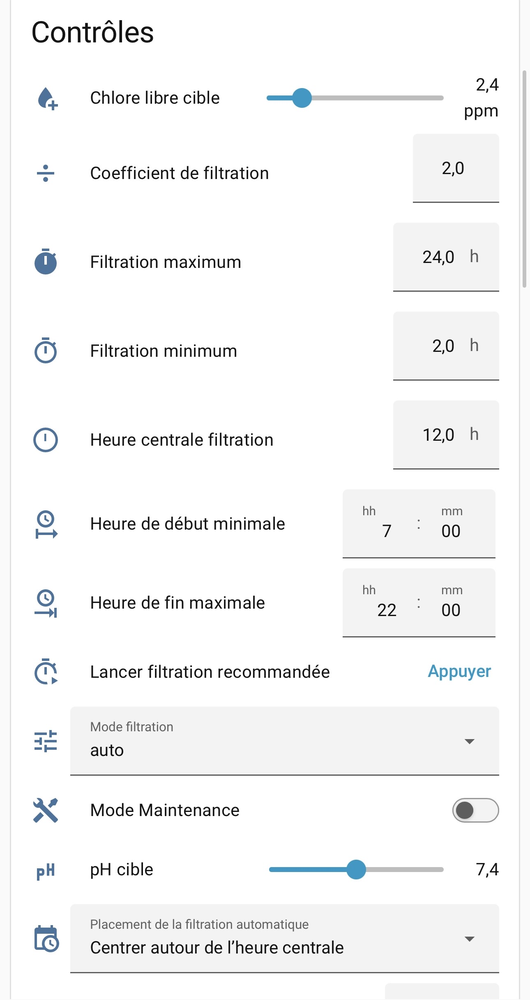
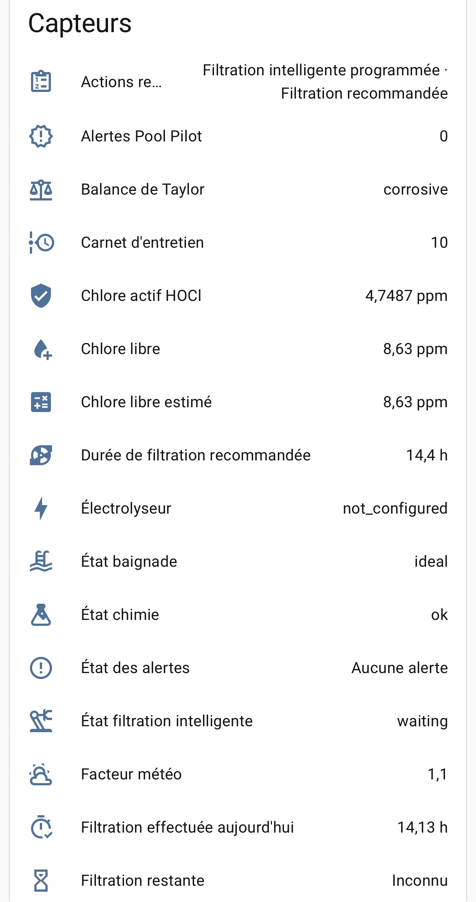
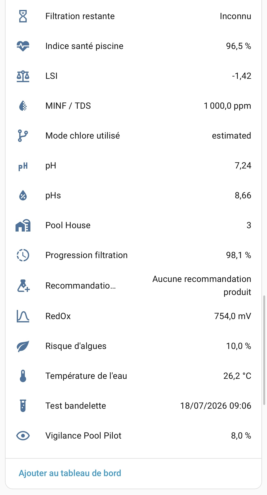
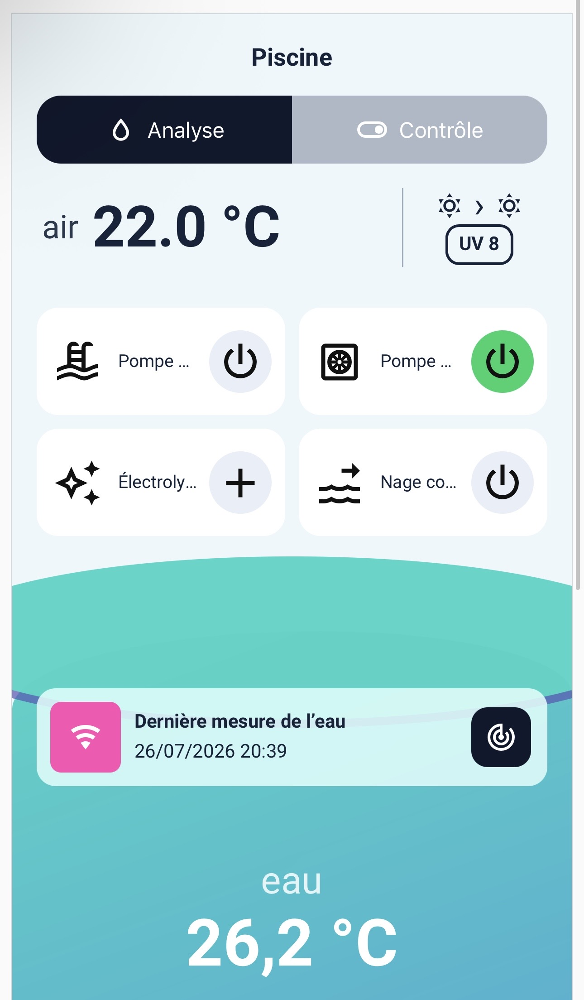

<p align="center">
  
</p>

<h1 align="center">Pool Pilot</h1>

<p align="center">
  Intégration Home Assistant pour analyser l’eau, calculer la filtration, suivre l’entretien et piloter les équipements d’une piscine.
</p>

<p align="center">
  <a href="https://github.com/amery74/ha-poolpilot/releases"></a>
  <a href="LICENSE"></a>
  <a href="https://github.com/amery74/ha-poolpilot/actions/workflows/validate.yml"></a>
  <a href="https://github.com/amery74/ha-poolpilot/actions/workflows/hassfest.yml"></a>
  <a href="https://github.com/amery74/ha-poolpilot/issues"></a>
</p>

## Sommaire

- [Présentation](#présentation)
- [Fonctionnalités](#fonctionnalités)
- [Compatibilité](#compatibilité)
- [Installation](#installation-avec-hacs)
- [Configuration](#configuration)
- [Filtration intelligente](#filtration-intelligente)
- [Mode Maintenance](#mode-maintenance)
- [Dépannage](#dépannage)
- [Contribution et support](#contribution-et-support)

## Présentation

**Pool Pilot** centralise les données utiles au suivi d’une piscine dans Home Assistant. L’intégration calcule la durée de filtration recommandée, analyse la qualité de l’eau, génère des alertes et recommandations, conserve un carnet d’entretien et expose des entités utilisables dans les tableaux de bord et les automatisations.

Elle peut fonctionner uniquement comme outil de suivi ou piloter les équipements configurés. La pompe, la pompe à chaleur, l’électrolyseur et les autres équipements restent facultatifs.

<p align="center">
  
</p>

## Fonctionnalités

- Analyse de la température, du pH, de l’ORP ou du chlore libre.
- Estimation du chlore libre lorsque seul l’ORP est disponible.
- Filtration intelligente avec durée recommandée et programmation quotidienne.
- Choix d’une filtration centrée autour d’une heure ou limitée dans une plage horaire.
- Suivi de la durée réalisée, de la progression et du temps restant.
- Mode Maintenance suspendant les automatismes Pool Pilot tout en laissant les commandes manuelles disponibles.
- Gestion simple ou avancée de l’électrolyseur, du pourcentage de production et du Boost facultatif.
- Prise en charge facultative de la pompe à chaleur.
- Alertes hiérarchisées, recommandations de traitement et dosages calculés.
- Balance de Taylor, LSI, pHs, minF et interprétation de l’équilibre de l’eau.
- Tests bandelette, carnet d’entretien et récapitulatifs quotidiens persistants.
- Gestion des stocks et produits du Pool House.
- Notifications configurables : eau, filtration, stock, batterie, rappel bandelette et résumé quotidien.
- Historique exploitable dans Home Assistant et dans la carte Pool Pilot Dashboard.

## Captures de l’intégration

| Contrôles | Capteurs principaux |
|---|---|
|  |  |

| Analyse de l’eau | Filtration et recommandations |
|---|---|
|  |  |

## Compatibilité

Pool Pilot accepte les entités standards de Home Assistant et ne dépend pas d’une marque unique. La compatibilité a notamment été validée avec **Poolex Aqualyser**. Des capteurs issus de Flipr ou d’autres équipements peuvent également être utilisés dès lors qu’ils exposent les mesures attendues dans Home Assistant.

Mesures prises en charge selon la configuration :

- température de l’eau ;
- pH ;
- ORP / RedOx ;
- chlore libre ;
- date de dernière mesure ;
- bouton facultatif de déclenchement d’une mesure ;
- TAC, TH, stabilisant et autres valeurs saisies par test bandelette.

## Installation avec HACS

### Dépôt personnalisé

Tant que le référencement officiel dans HACS n’est pas validé :

1. Ouvrir **HACS**.
2. Aller dans **Intégrations** puis **Dépôts personnalisés**.
3. Ajouter :

```text
https://github.com/amery74/ha-poolpilot
```

4. Sélectionner la catégorie **Intégration**.
5. Installer **Pool Pilot** puis redémarrer Home Assistant.
6. Aller dans **Paramètres → Appareils et services → Ajouter une intégration**.
7. Rechercher **Pool Pilot**.

### Installation manuelle

Copier le dossier :

```text
custom_components/pool_pilot
```

dans :

```text
/config/custom_components/
```

puis redémarrer Home Assistant.

## Configuration

L’assistant demande uniquement les informations nécessaires à votre installation :

- nom et volume du bassin ;
- type de traitement et revêtement ;
- capteurs de température, pH, ORP ou chlore libre ;
- météo ou température prévue ;
- commande et/ou état de la pompe, tous deux facultatifs ;
- pompe à chaleur et électrolyseur facultatifs ;
- paramètres de filtration et seuils de qualité de l’eau ;
- préférences de notifications.

Il n’est pas nécessaire de créer de fausses entités pour terminer la configuration. Une fonction absente de l’installation peut simplement rester non configurée.

## Filtration intelligente

La durée quotidienne est calculée à partir de la température de l’eau, des conditions météo et des limites définies par l’utilisateur. La programmation peut être :

- **centrée** autour d’une heure choisie ;
- **encadrée** entre une heure minimale de début et une heure maximale de fin.

L’intégration expose notamment l’état du cycle, la durée cible, la durée réalisée, la progression, le temps restant et la prochaine programmation.

## Mode Maintenance

Le mode Maintenance suspend les décisions et automatismes de Pool Pilot afin d’éviter tout redémarrage automatique pendant une intervention. Les mesures et historiques continuent d’être enregistrés et les équipements restent commandables manuellement depuis Home Assistant.

## Carte recommandée

Pour profiter de l’interface complète, installer également :

```text
https://github.com/amery74/pool-pilot-dashboard
```

Catégorie HACS : **Tableau de bord / Plugin**.

<p align="center">
  
  
</p>

## Dépannage

Après une mise à jour :

1. redémarrer Home Assistant ;
2. vérifier **Paramètres → Système → Journaux** ;
3. recharger complètement l’application ou le navigateur si la carte conserve une ancienne version.

Commande Home Assistant OS utile :

```bash
ha core logs -n 100
```

Pour signaler un problème, ouvrir une issue en joignant la version de Home Assistant, la version de Pool Pilot, les entités utilisées et les logs utiles.

## Versions

- Intégration Pool Pilot : **v1.2.3**
- Pool Pilot Dashboard recommandé : **v1.2.3** ou plus récent
- Home Assistant minimal déclaré : **2025.1.0**

## Contribution et support

- Problèmes et demandes : [GitHub Issues](https://github.com/amery74/ha-poolpilot/issues)
- Consignes de contribution : [CONTRIBUTING.md](CONTRIBUTING.md)
- Support : [SUPPORT.md](SUPPORT.md)
- Sécurité : [SECURITY.md](SECURITY.md)

## Licence

Pool Pilot est distribué sous la licence indiquée dans le fichier [LICENSE](LICENSE).
